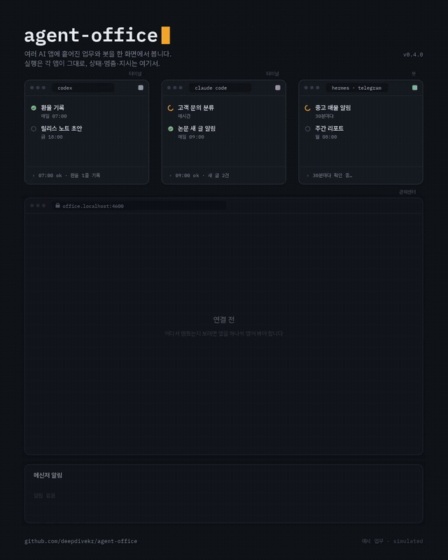
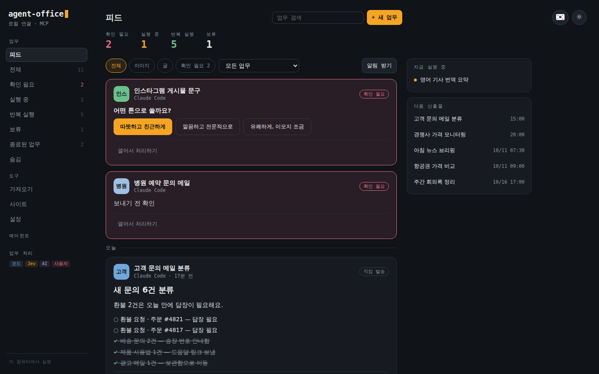
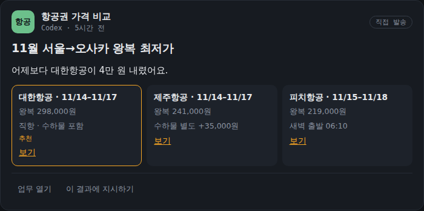
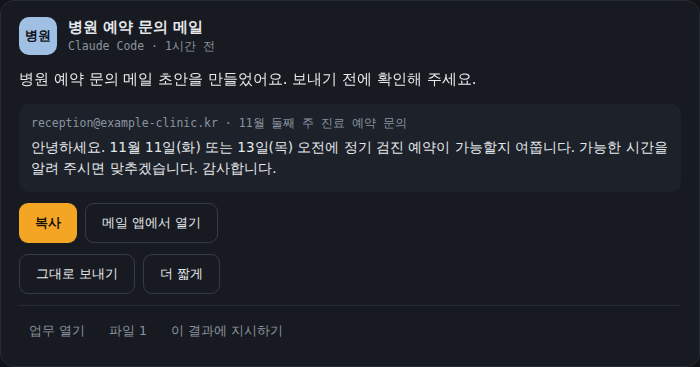
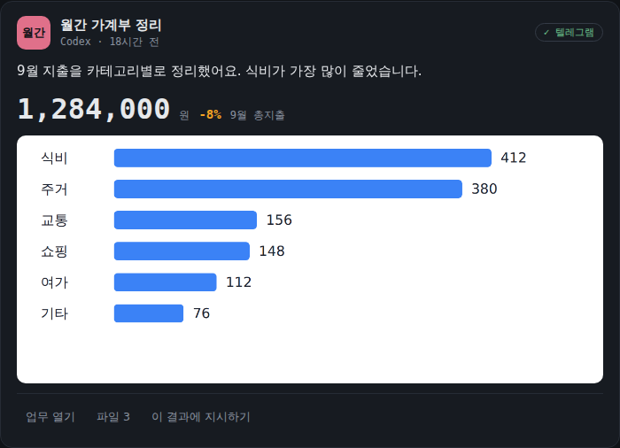
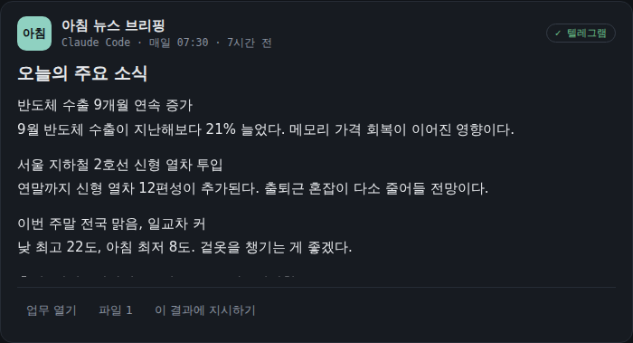
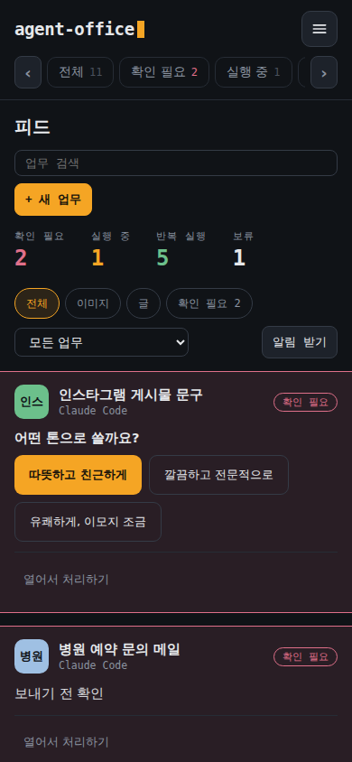
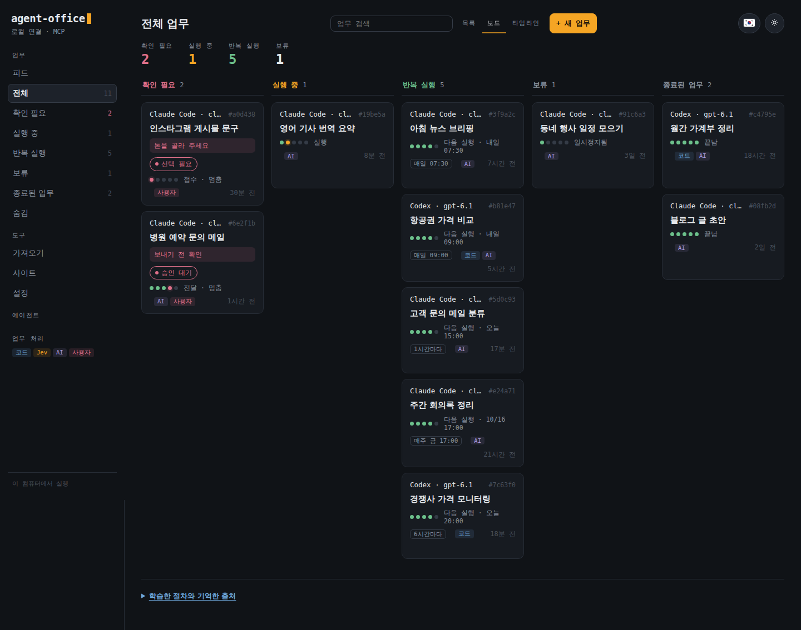
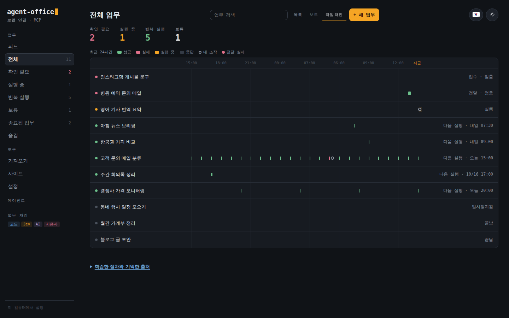
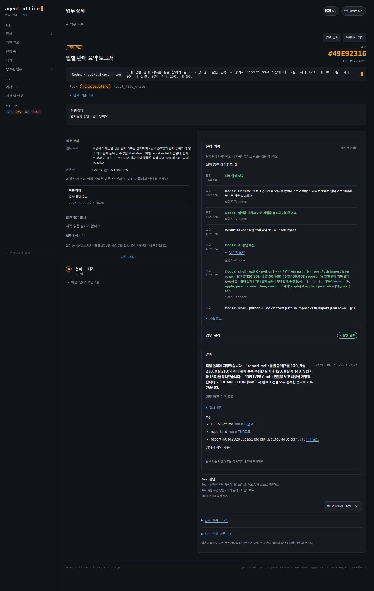

# Agent Office

**Codex, Claude Code, 헤르메스, 스크립트… 여러 곳에 흩어진 봇과 자동화를 한 화면에서 관리합니다.** 실행은 각 앱과 내 계정이 그대로 맡고, Agent Office에서는 상태를 보고, 멈추면 알림을 받고, 지침을 고치고, 다시 실행합니다. 결과는 피드 한 곳에 모입니다.

<p align="center"></p>
<p align="center"><a href="docs/images/hero.mp4">고화질 MP4</a> · <a href="docs/motion/hero">만드는 방법</a></p>

멈춘 업무를 그냥 넘기지 않습니다. *확인 필요*에 올라오고, 메신저를 연결했다면 알림이 갑니다. 새 반복 업무는 한 줄로 맡기면 정해진 때에 실행됩니다.

[English](README.md) · **한국어** · [v0.5.0 변경 내역](docs/releases/v0.5.0.md)

로컬 MCP 서버이기도 해서 Codex, Claude Code, Cursor, OpenCode, Hermes 같은 MCP 클라이언트가 업무를 넘길 수 있습니다.
명령 이름은 `agent-office`입니다. 이전 `agent-driver` 명령도 호환용으로 남아 있습니다.

## 피드: 결과가 모이는 곳



AI 앱에 일을 맡길수록 결과는 흩어집니다. 아침 브리핑은 텔레그램에, 정리한 표는 작업 폴더에, 메일 초안은 대화창 어딘가에 남습니다. 반복 업무가 열 개쯤 되면 "어제 그 결과가 어디 있었지"를 찾는 데 시간을 씁니다. 보드는 업무가 어떤 상태인지 알려 주지만, 정작 매일 받아 보는 건 결과입니다.

그래서 피드를 만들었습니다. 모든 업무의 결과를 시간순으로 한곳에 모으고, 결과마다 쓰임새에 맞는 모양으로 보여 줍니다.

- **한 줄로 모읍니다.** Office가 저장한 결과뿐 아니라 서버의 봇이 보낸 메시지, 연결한 AI 대화의 마지막 답, AI 앱이 다른 곳으로 보낸 결과까지 같은 줄에 올라옵니다.
- **쓰임새대로 보여 줍니다.** 글은 기사처럼 읽히고, 후보는 나란히 비교하고, 메일 초안은 보내기 전에 확인하고, 지출은 숫자와 차트로 보입니다. 할 일 목록, 일정, 가격 변화 카드도 있습니다.
- **내 차례는 맨 위에.** 고를 것이 있거나 보내기 전 확인이 필요한 업무는 피드 위에 고정되고, 그 자리에서 바로 답합니다.
- **결과에 바로 지시합니다.** "더 짧게", "이 항공편으로 다시 알아봐" 같은 다음 지시를 결과 아래에서 같은 업무에 보냅니다.
- **폰에서도.** 알림을 켜 두면 새 결과가 폰으로 옵니다. 지금 실행 중인 업무와 다음 결과가 나올 시각은 옆에 따로 보입니다.

<details>
<summary>결과 카드 예시</summary>

| 비교 | 보내기 전 확인 |
|---|---|
|  |  |
| **숫자와 차트** | **기사처럼 읽는 글** |
|  |  |

<p align="center"></p>

</details>

## 화면으로 보기

**업무 보드**: 한 줄로 업무를 맡기고, 상태별로 모아 봅니다.



**타임라인**: 최근 24시간 동안 각 업무가 언제 돌았고 어떻게 끝났는지 한눈에 봅니다.



<details>
<summary>업무 상세 화면 보기</summary>

**업무 상세**: 앱이 실제로 실행한 기록, 앱이 보고한 완료 확인, 결과 파일을 봅니다.



</details>

보드·타임라인·피드의 업무와 결과는 설명용 예시입니다. 업무 상세는 새로 설치한 상태에서 예시 업무(석 달 치 판매 기록을 `report.md`로 정리)를 Codex로 실제 실행한 화면입니다.

## 지원 환경

실행 흐름은 [실행 안내](docs/work-operation.md), 확인한 범위와 남은 제약은 [출시 검증 기록](docs/release-readiness-v0.5.0.md)에 정리합니다.

| 환경 | 상태 |
|---|---|
| Ubuntu 24.04 x86_64 | 브라우저·CLI·파일 업무 지원 |
| Windows 11 + WSL2 Ubuntu 24.04 | 같은 Linux 런타임 사용 |
| Windows 네이티브 앱 제어 | 실험 기능. 별도 실행기·권한 설정 필요 |
| macOS | 설치·실환경 검증 미완료 |

기본 브라우저는 전용 백그라운드 Chromium이고, VM은 선택 사항입니다.
모든 데스크톱 앱을 설치 직후 바로 제어하지는 못합니다.

## 시작하기

에이전트에게 이렇게 요청하세요.

> github.com/deepdivekr/agent-office를 설치하고 MCP로 연결해줘. 앞으로 브라우저·파일 업무에 Agent Office를 사용해줘.

직접 설치하려면 **Ubuntu 또는 WSL Ubuntu 터미널**에서 실행합니다. 어느 폴더에서 실행해도 됩니다.

```bash
bash -o pipefail -c 'curl -fsSL https://raw.githubusercontent.com/deepdivekr/agent-office/v0.5.0/install.sh | bash'
```

설치 전에 [스크립트](install.sh)를 확인할 수 있습니다.
설치기는 전용 Node.js·의존성·Chromium을 준비하고 관제센터를 엽니다.
시스템 라이브러리가 부족하면 필요한 명령을 알려 주고, 관리자 권한은 쓰지 않습니다.

### 관제센터에서 연결

도구를 한 번 연결하면 보드에서 업무를 맡길 수 있습니다.

1. **클라이언트 연결**: 설치·로그인을 확인하고 MCP를 등록합니다.
2. **실행 환경**: 기본 브라우저를 쓰거나 다른 실행기를 연결합니다.
3. **AI 연결**: 업무를 맡을 앱(Codex 또는 Claude Code)과 기본 모델을 고릅니다.
4. **결과 수신(선택)**: Telegram·Slack·Discord 수신처를 저장합니다. 결과는 피드에도 남습니다.
5. **첫 업무**: 작업 지침·완료 조건·결과 수신처를 정해 맡깁니다. 완료 조건을 비우면 AI가 정리합니다.

Jev는 선택 사항입니다. 연결하지 않아도 LLM과 코드로 진행합니다.
사이트 로그인은 업무에서 필요할 때 요청합니다.

Aside·Neo는 따로 설치하고 실행해야 합니다. 관제센터에서 연결 상태를 확인하고 등록하며, 연결하지 않으면 기본 Playwright를 씁니다. [실행기 연결 안내](docs/browser-executor-setup.md)

관제센터를 다시 열려면 같은 Ubuntu 환경에서 실행하세요.

```bash
~/.local/bin/agent-office connect
```

MCP를 직접 등록하려면 `agent-office mcp`를 쓰고, Windows 앱에는 관제센터가 보여 주는 WSL 연결 명령을 씁니다.
[첫 실행 안내](docs/first-run.md) · [MCP 설정](docs/agent-interface.md)

## 어떤 업무를 맡기나요?

> 매일 아침 7시 반에 주요 뉴스 세 가지를 출처와 함께 정리해서 텔레그램으로 보내줘.

> 11월 둘째 주 서울–오사카 왕복 항공권을 매일 비교하고, 가격이 내리면 알려줘.

> 새로 온 고객 문의 메일을 한 시간마다 분류하고, 답장이 필요한 것만 추려줘.

> 이번 달 카드 내역 파일을 카테고리별로 정리하고 지난달과 비교해줘.

> 병원에 보낼 예약 문의 메일을 써줘. 보내기 전에 나한테 보여주고.

**Work**는 이렇게 맡긴 업무 하나입니다. 실행 기록·완료 조건·진행 상황을 한곳에서 관리합니다.
공개 수용 세트(공식 사이트 확인, 공개 데이터 CSV 저장, 양식 초안 등 5건)는 구독 모델(Codex)로 중간 클릭 없이 끝까지 완료됐고, 건당 1.5~3분이 걸렸습니다. [기록](docs/work-completion-acceptance-set.md)

기본 동작:

- **되묻기.** 맡기면 결과를 좌우하는 조건을 먼저 묻습니다. 바로 실행하려면 체크를 끄세요.
- **끝까지 실행.** AI 사용을 한 번 허용하면 시작한 업무는 결과까지 진행하고, 반복 일정도 스스로 이어 갑니다. 제출·결제·제3자에게 보내는 일은 매번 따로 확인합니다.
- **초안은 제출되지 않습니다.** 양식 초안은 전용 페이지에서 채우고 끝나면 닫습니다.
- **브라우저는 화면을 방해하지 않습니다.** 백그라운드 브라우저가 먼저 읽고, 사이트가 막으면 연결된 Aside로 그 읽기만 넘깁니다.
- **쓸수록 빨라집니다.** 검증을 통과한 업무는 절차를 남기고, 비슷한 요청은 그 절차로 읽기 단계를 AI 호출 없이 반복합니다. 남긴 절차와 기억한 출처는 보드 아래에서 보고 끌 수 있습니다.
- **작은 MCP 목록.** `agent-office mcp`는 업무용 도구 10개(약 2천 토큰)만 보여 줍니다. 나머지도 이름으로 호출할 수 있고, `--all-tools`로 전체 114개를 볼 수 있습니다.

### 요청부터 결과까지

1. **업무 시작**: 한 줄로 요청하면 상세 화면이 열립니다. 고른 AI가 업무를 분석하고, 중요한 조건을 물은 뒤 실행합니다.
2. **진행 확인**: AI 앱이 실행한 명령·만든 파일·메시지, 확인한 출처, 기다리는 이유가 실행 기록에 남습니다.
3. **방향 수정**: 단계를 눌러 일시정지·지침 수정·이어가기를 합니다. 새 지시는 같은 앱의 같은 세션에 그대로 전달됩니다.
4. **결과 확인**: 결과와 출처, 파일은 피드와 상세 화면에서 봅니다. 완료 조건이 확인되기 전에는 완료로 표시하지 않습니다.

새 업무의 결과는 기본으로 피드에 남고, 저장한 메신저를 고르면 함께 받습니다. [수신 설정과 제약](docs/work-delivery.md)

기본 **Pack family 9종**은 업무의 출발점입니다.

| 범주 | 예시 |
|---|---|
| 검색 | 조사·출처 비교 |
| 포털 수집 | 조회·다운로드 |
| 폼 작성·제출 | 신청서·문의 양식 |
| 기록 수정 | 기존 항목 변경 |
| 받은함 분류 | 메시지·요청 정리 |
| 모니터링 | 변경 확인·알림 |
| 파일 처리 | 정리·변환·통합 |
| 후보 선택 | 비교·다음 단계 준비 |
| 코딩 오케스트레이션 | CLI 세션에 지시·결과 검토 |

Pack을 먼저 만들 필요는 없습니다. LLM이 요청을 구조화하고, 검증된 절차를 다시 씁니다.
자주 하는 업무는 검증을 마친 Work를 이름과 버전이 붙은 커스텀 Pack으로 저장해 재사용할 수 있습니다. [커스텀 Pack 사용](docs/custom-pack-operation.md)

## 누가 실행하나요?

업무는 맡길 때 고른 AI 앱(Codex 또는 Claude Code, 모델과 추론 강도 포함)이 그 앱의 설정·스킬·MCP 서버를 그대로 써서 실행합니다.
한 업무는 처음부터 끝까지 그 앱이 맡습니다. 로그인이 풀리거나 사용량이 바닥나면 업무가 기다리고, 다른 앱으로 넘어가지 않습니다.

- **LLM**: 업무를 나누고, 처음 보는 상황을 판단하고, 다시 계획합니다.
- **Jev(선택)**: Pack에 정의된 짧은 판단을 처리합니다.
- **코드와 실행기**: 클릭·입력·파일 작업을 하고 결과를 검증합니다.
- **런타임**: 체크포인트·세션·실행 기록을 남깁니다. 결과가 불분명한 쓰기는 함부로 다시 실행하지 않습니다.

### 이미 돌고 있는 것 가져오기

이미 다른 곳에서 돌고 있는 것은 **가져오기**로 연결합니다. 원래 실행 환경·예약·메신저 전송은 그대로 두고, 가져오기만으로 중복 실행하거나 새 예약을 켜지 않습니다.

- **Hermes·원격 OpenClaw**: 원래 런타임에서 계속 실행하고, 상태 확인과 지시는 Office에서 합니다.
- **내 서버의 서비스**: SSH로 systemd 서비스·타이머·Docker 컨테이너 상태를 읽기 전용으로 지켜봅니다. 타이머가 돈 기록은 타임라인에, 봇이 보낸 메시지는 피드에 올라옵니다.
- **AI 대화**: 데스크톱 앱이나 터미널에서 쓰던 Claude Code·Codex 대화를 업무로 붙이고, 대화가 쉬는 동안 Office에서 이어서 지시합니다. WSL에 설치했다면 Windows 앱의 대화도 연결됩니다.
- **다른 앱의 자동화**: 복사용 프롬프트를 기존 AI에 붙여 넣고, 받은 답으로 업무 초안을 만듭니다.

[업무 가져오기](docs/work-migration.md) · [원격 관리](docs/remote-office.md)

## 업데이트와 제약

AI 설정에서 **CLI 자동 업데이트**를 켜거나 **지금 업데이트**를 누르세요. 관제센터가 켜져 있고 진행 중인 업무가 없을 때 24시간마다 Linux/WSL CLI를 확인하며, 실행 중인 앱은 건드리지 않습니다. Windows 자동 업데이트는 아직 지원하지 않습니다.

Agent Office를 업데이트하려면 진행 중인 업무를 마치고 MCP 클라이언트와 관제센터를 종료한 뒤 설치 명령을 다시 실행합니다.
공유 서버가 남아 있다면 [종료·재연결 안내](docs/mcp-resource-lifecycle.md)를 따르세요.
앱은 `~/.local/share/agent-office`, 설정과 업무 데이터는 `~/.agent-office`에 저장합니다. 기존 `~/.agent-driver`의 업무는 그대로 이어 씁니다.
개인 실행 코드를 추가한 설치본은 먼저 [호환성 확인](docs/local-workflow-compatibility.md)을 하세요.

- Aside·Neo 어댑터는 지금 **조회 전용**입니다. 폼 쓰기와 VM 내부 연결은 지원하지 않습니다.
- 로그인·CAPTCHA·승인은 사람이 처리합니다.
- 로컬 연결 주소의 토큰, API 키, 개인 업무 데이터는 공유하지 마세요.

[출시 검증 범위](docs/release-readiness-v0.5.0.md) · [AI 설정](docs/control-settings.md) · [브라우저 라우팅](docs/browser-executor-routing.md) · [메모리와 서버 수명](docs/mcp-resource-lifecycle.md)

## 개발과 라이선스

```bash
git clone https://github.com/deepdivekr/agent-office.git
cd agent-office
npm ci
npm test
```

Node.js **22.22.0**, npm **11.11.0**을 사용합니다. 기본 검사는 장시간 soak를 제외합니다.

README 화면은 `node scripts/docs/capture-readme-feed.mjs ko|en`(보드·타임라인·피드, 예시 데이터)과 `scripts/docs/capture-readme-ui.mjs`(업무 상세)로 다시 만듭니다.

[Apache License 2.0](LICENSE). 연결하는 모델·브라우저·외부 서비스의 라이선스와 이용 조건은 별도입니다.
