# Agent Office

**Bots and automations scattered across your AI clients — Codex, Claude Code, Hermes, scripts — managed from one screen.** Each one still runs on its own client and your own accounts. Agent Office is where you see their status, hear when one stops, change instructions and run again.



Nothing fails silently: a stopped run shows up in *Needs you* and, if you connected one, in your messenger. New recurring work takes one line and runs when it is due.

**English** · [한국어](README.ko.md) · [v0.4.0 release notes](docs/releases/v0.4.0.md)

It is also a local MCP server, so Codex, Claude Code, Cursor, OpenCode, Hermes or another MCP client can hand it work.
Install and run it as `agent-office`. The old `agent-driver` command remains a compatibility alias.

## A look inside

**Work board** — describe the work in one line and follow it by status.


<details>
<summary>Work detail</summary>

**Work detail** — the app's own run as it happened, the completion check it reported, and the result files.


</details>

A real run of a made-up sample task (summarise a three-month sales log into `report.md`) with Codex on a fresh install. No web access, nothing sent outside.

## Supported environments

See [Work operation](docs/work-operation.md) for the execution loop and [release verification](docs/release-readiness-v0.4.0.md) for tested scope and remaining limits.

| Environment | Status |
|---|---|
| Ubuntu 24.04 x86_64 | Browser, CLI, and file workflows |
| Windows 11 + WSL2 Ubuntu 24.04 | Runs the same Linux runtime |
| Native Windows desktop control | Experimental; executor and permission setup required |
| macOS | Installation and native operation not validated |

The default browser is a dedicated background Chromium. A VM is optional.
Out-of-the-box control of every desktop app is not supported.

## Get started

Ask your agent:

> Install github.com/deepdivekr/agent-office and connect it over MCP. Use Agent Office for my browser and file work.

Or run this from **Ubuntu or WSL Ubuntu**, in any directory:

```bash
bash -o pipefail -c 'curl -fsSL https://raw.githubusercontent.com/deepdivekr/agent-office/v0.4.0/install.sh | bash'
```

You can [review the installer](install.sh) first.
It prepares a dedicated Node.js, dependencies, and Chromium, then opens the Control Center.
Missing system libraries produce setup instructions; the installer does not run privileged commands automatically.

### Connect in the Control Center

Connect your tools once, then submit a Work from the board. See [From request to result](#from-request-to-result).

1. **Clients** — check installation and login, then register MCP.
2. **Execution** — use the default browser or connect an optional executor.
3. **AI** — choose the app that runs your work (Codex or Claude Code) and its default model.
4. **Delivery (optional)** — save Telegram, Slack or Discord destinations. Results always remain available in the app.
5. **First Work** — enter instructions, a completion condition and result destinations. Leave the condition blank for AI to derive it. The detail opens immediately; guided mode asks for your choices first.

Jev is optional. Without it, the LLM and code handle decisions.
Website login is requested when a task needs it.

Aside and Neo require their own installation and running application.
Check and register them in the Control Center. Leave them unconnected to use Playwright.
Fallback stays within the authorized environment. [Browser setup](docs/browser-executor-setup.md)

To reopen the Control Center, run this in the same Ubuntu environment:

```bash
~/.local/bin/agent-office connect
```

For manual MCP registration, use `agent-office mcp`.
Windows clients should use the WSL command shown in the Control Center.
[First-run guide](docs/first-run.md) · [MCP configuration](docs/agent-interface.md)

## What can I ask it to do?

> Research three companies' official announcements and make a comparison table with sources.

> Fill out this inquiry form. Stop before submitting it.

> Resume this project's coding work, then have another CLI review the changes.

A **Work** holds your request, completion checks, progress, and run history.

For a specific recurring task, save an independently verified Work as a named
custom Pack version. Each new cycle reuses its procedure and verifies fresh
output. [Custom Pack operation](docs/custom-pack-operation.md)

### Try these first

These seven requests are the public acceptance set. On 2026-10-01 they all completed without a
click in between, with Codex as the subscription model, both with the background browser alone and
with Aside connected ([record](docs/work-completion-acceptance-set.md)). Each took 1.5–3 minutes.

- `Find the current Node.js LTS version and its release date on the official site and save a one-line summary`
- `Save earthquakes of magnitude 4.5+ from the USGS public feed for the past 24 hours as CSV with time, magnitude and place`
- `Check the latest post on the nodejs.org blog once and keep watching for new posts`
- `Fill the form at httpbin.org/forms/post with name Kim and size Medium as a draft; do not submit`
- `Find the latest stable Python and Node.js versions on their official sites and save them as JSON`

How it behaves by default:

- **Small MCP surface.** `agent-office mcp` lists 10 Work tools (about 2k tokens) instead of all 114 (about 29k).
  Every other tool keeps its name and stays callable; `agent-office mcp --all-tools` lists them all.
- **Works right after install.** `agent-office connect` records the default non-interfering mode, so MCP starts
  without another click. The first Work asks once for permission to send its text to your AI.

- **Ask first.** The Work form asks the conditions that matter before it starts. Uncheck it for a quick run.
- **Runs to the result.** After you allow AI use once, a Work you start runs to its result and keeps its own
  schedule (`work.autonomy: delegated`). Submissions, payments and messages to other people still ask you.
- **Browser.** A background browser reads first and never takes over your screen. Official pages are opened
  directly; public search uses the provider that answers a background browser. If a site refuses it and you
  connected Aside, the same read moves there once.
- **Nothing is submitted by a draft.** A form draft is filled in a private page that can only read; it is closed afterwards.
- **Gets faster with use.** A Work that passed verification leaves its procedure behind; a similar request reuses
  it and repeats its reads without model turns. A public table that was read (CSV, JSON, GeoJSON) is remembered as a
  source, so the next collection is checked row by row in code. Both are listed on the first screen, where you can
  turn a procedure off or forget a source. Each new Work is still verified on its own.
- **What the delegation covers.** `work.delegation` in the host file: `daily_scheduled_runs` (50),
  `registered_folder_moves` (on: a reversible move plan inside a folder you granted for moving is applied without
  a click) and `remember_public_sources` (on).

### From request to result

The detail page groups source visits and tool activity under outcome-based work stages. A finished tool call is not a verified result.

1. **Start work** with one request. The detail opens immediately while AI analyzes the work, asks what matters, and runs it using your selected AI allowance.
2. **Follow** the readable execution timeline: the AI app's commands, files and messages, observed sources, and any wait reason.
3. **Adjust** a stage by clicking it. Its dialog offers pause, new instructions, and resume at the supported execution boundary.
4. **Read the result** in the app, with sources and downloads. A saved result is not marked complete until its completion checks pass.

Missing connections or required choices appear in the detail. External changes and original-runtime controls keep their own approval boundaries. MCP registration and importing an existing bot do not start a duplicate run.

New Work returns results in the app by default. Select multiple saved messenger destinations to receive verified output there too. Click the final delivery stage to change unsent output and future deliveries. [Delivery setup and limits](docs/work-delivery.md)

The nine built-in **Pack families** provide reusable workflow patterns.

| Family | Examples |
|---|---|
| Search | Research and source comparison |
| Portal collection | Queries and downloads |
| Form drafting and submission | Applications and inquiry forms |
| Record updates | Changes to existing entries |
| Inbox triage | Message and request classification |
| Monitoring | Change checks and alerts |
| File pipelines | Organization, conversion, and merging |
| Candidate selection | Comparisons and staging |
| Coding orchestration | CLI instructions and result review |

You do not need to write a Pack first.
The LLM structures the request; verified procedures can be reused.
Changed pages or environments require fresh checks. Repeat runs are not guaranteed to be faster.

## How does work continue?

- **LLM**: planning, unfamiliar situations, and replanning.
- **Jev (optional)**: short, typed decisions defined by the Pack.
- **Code and executors**: browser, CLI, and file actions with result verification.
- **Runtime**: checkpoints, sessions, and run records. Uncertain writes are not blindly replayed.

Each Work runs on the AI app chosen when it was started (Codex or Claude Code, with a model and reasoning effort), using that app's own settings, skills and MCP servers.
That app keeps the Work for its whole life: when its sign-in or allowance runs out, the Work waits; it never moves to another app.

Use **Import** to connect existing work. Supported Hermes and remote OpenClaw connections keep the original runtime, schedule, and messenger delivery.
Importing alone does not start a duplicate bot or activate a new schedule. Monitoring and control require the original runtime connection, not just a code folder.
[Work import](docs/work-migration.md) · [Remote management](docs/remote-office.md)

## Updates and limits

AI settings include **Auto-update CLIs** and **Update now**. Supported user-owned Linux/WSL CLIs are checked every 24 hours while Office is running and idle; active clients are left alone.
Save the preference to enable automatic checks. Windows automatic updates are not supported yet.

Finish active work, disconnect MCP clients, and close the Control Center before rerunning the installer.
If the shared server is still running, follow the [stop and reconnect guide](docs/mcp-resource-lifecycle.md).
New installs use `~/.local/share/agent-office` and keep settings and Work data in `~/.agent-office`.
Existing `~/.agent-driver` data is reused in place; old installations are not deleted.
Installations with private workflow code need a [compatibility review](docs/local-workflow-compatibility.md).

- Aside and Neo adapters are currently **read-only**. Form writes and guest-VM transports are not supported.
- People handle authentication, CAPTCHAs, and approvals.
- Queued Work does not allocate a VM per task. Active browsers and model CLIs consume additional resources.
- Keep local connection tokens, API keys, and private workflow data out of shared files.

[Release validation](docs/release-readiness-v0.4.0.md) · [AI settings](docs/control-settings.md) · [Browser routing](docs/browser-executor-routing.md) · [Memory and process lifecycle](docs/mcp-resource-lifecycle.md)

## Development and license

```bash
git clone https://github.com/deepdivekr/agent-office.git
cd agent-office
npm ci
npm test
```

Use Node.js **22.22.0** and npm **11.11.0**.
The default test suite excludes long soak tests.

[Apache License 2.0](LICENSE). Connected models, browsers, and services have their own licenses and terms.
