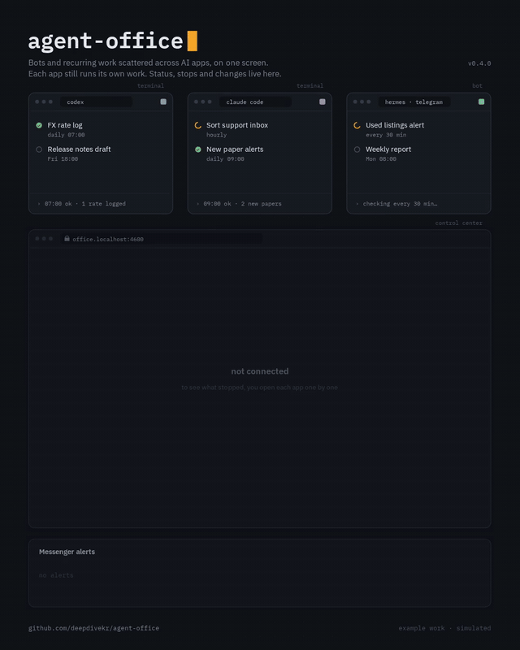
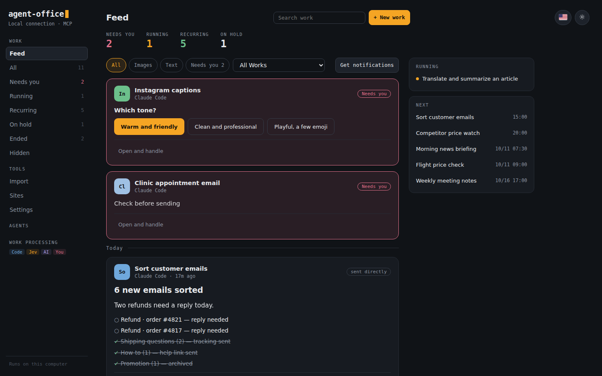
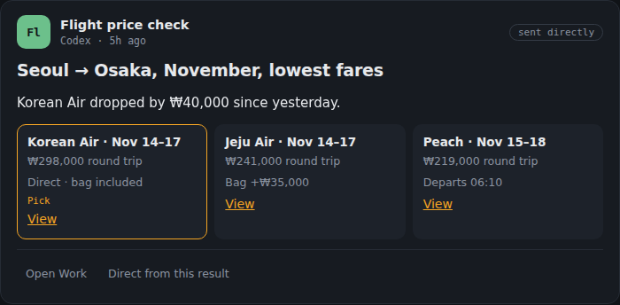
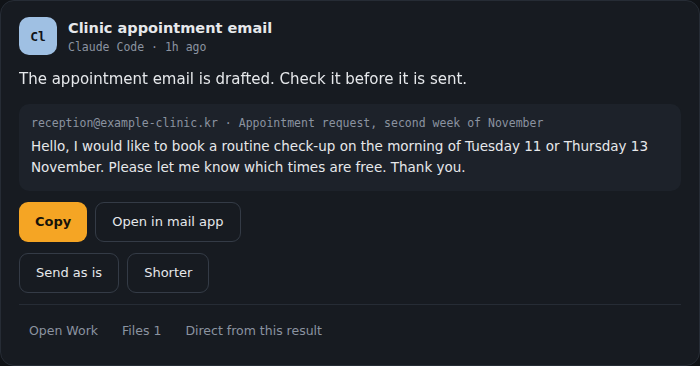
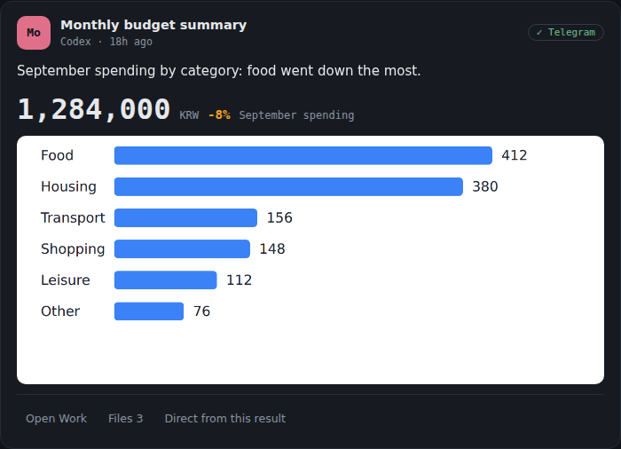
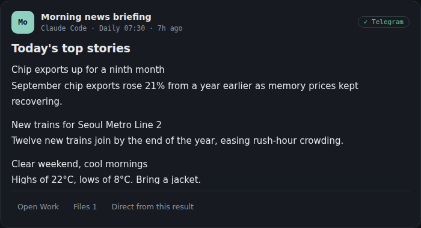
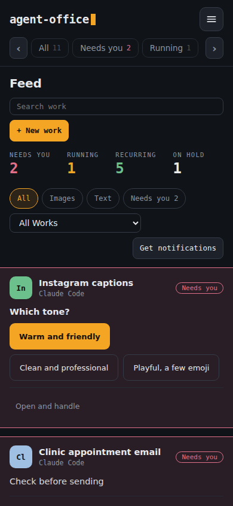
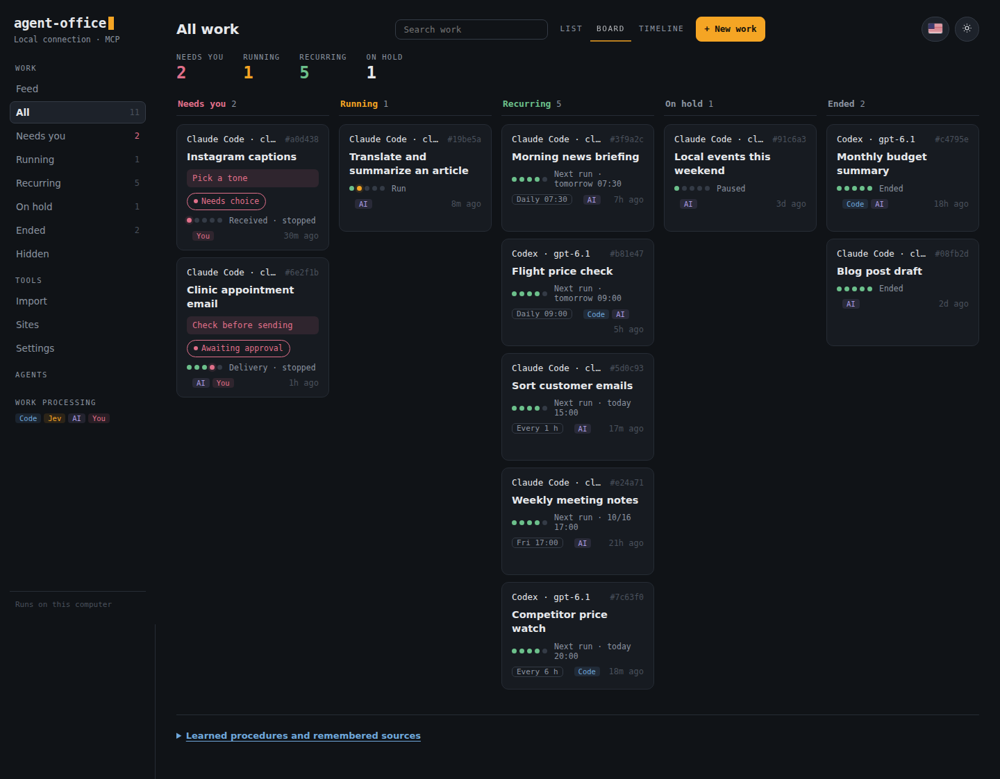
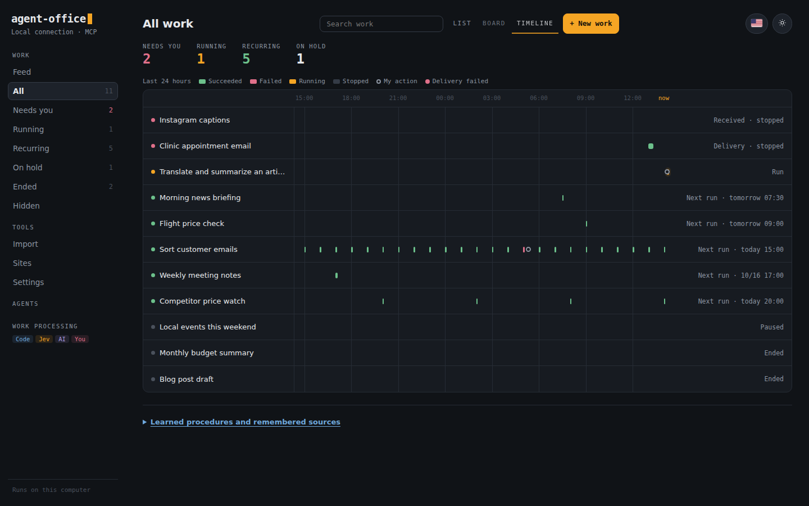
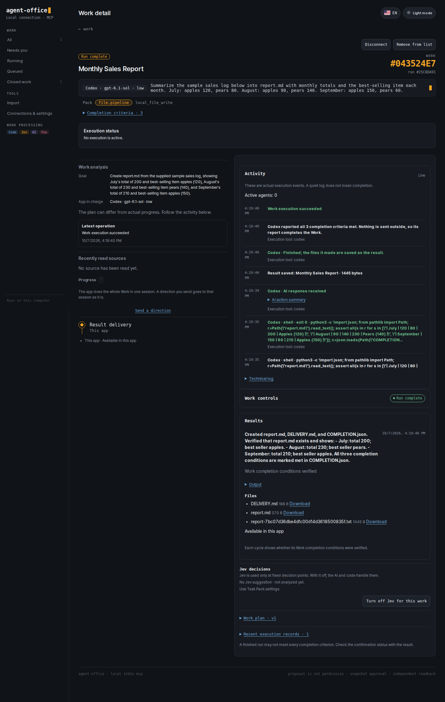

# Agent Office

**Bots and automations scattered across your AI clients — Codex, Claude Code, Hermes, scripts — managed from one screen.** Each one still runs on its own app and your own accounts. In Agent Office you see their status, hear when one stops, change instructions and run them again. Their results come together in one feed.

<p align="center"></p>
<p align="center"><a href="docs/images/en/hero.mp4">Full-quality MP4</a> · <a href="docs/motion/hero">how it is made</a></p>

Nothing stops silently: a stopped run shows up in *Needs you* and, if you connected one, in your messenger. New recurring work takes one line and runs when it is due.

**English** · [한국어](README.ko.md) · [v0.5.0 release notes](docs/releases/v0.5.0.md)

It is also a local MCP server, so Codex, Claude Code, Cursor, OpenCode, Hermes or another MCP client can hand it work.
Install and run it as `agent-office`. The old `agent-driver` command remains a compatibility alias.

## The feed: where results come together



The more work you hand to AI apps, the more the results scatter. The morning briefing lands in Telegram, the cleaned-up table in a work folder, the email draft somewhere in a chat. With ten recurring tasks you spend time asking where yesterday's result went. The board tells you how each Work is doing, but what you actually read every day is the results.

So we built the feed. It puts the results of every Work in one stream, newest first, and shows each one in the shape it is used.

- **One stream.** Results Office saved, messages your server bots sent, the last answer of a conversation you attached, and results an AI app sent elsewhere all land in the same place.
- **Shaped for use.** Writing reads like an article, options sit side by side, an email draft waits for your check before it goes out, spending shows as a number and a chart. There are checklist, event and price-change cards too.
- **Your turn comes first.** A Work that needs a choice or a check before sending is pinned at the top, and you answer right there.
- **Reply to a result.** Send the next instruction — "shorter", "look again for this flight" — from under the result to the same Work.
- **On your phone.** Turn on notifications and new results reach your phone. What is running now and when the next results are due sit beside the stream.

<details>
<summary>Result cards</summary>

| Side by side | Check before sending |
|---|---|
|  |  |
| **A number and a chart** | **Writing that reads like an article** |
|  |  |

<p align="center"></p>

</details>

## A look inside

**Work board** — describe the work in one line and follow it by status.



**Timeline** — when each Work ran in the last 24 hours and how it ended.



<details>
<summary>Work detail</summary>

**Work detail** — the app's own run as it happened, the completion check it reported, and the result files.



</details>

The Works and results on the board, timeline and feed are samples. The detail is a real run of a made-up task (summarise a three-month sales log into `report.md`) with Codex on a fresh install.

## Supported environments

See [Work operation](docs/work-operation.md) for the execution loop and [release verification](docs/release-readiness-v0.5.0.md) for tested scope and remaining limits.

| Environment | Status |
|---|---|
| Ubuntu 24.04 x86_64 | Browser, CLI, and file workflows |
| Windows 11 + WSL2 Ubuntu 24.04 | Runs the same Linux runtime; browser, CLI and file workflows |
| Operating apps installed on a Windows PC (outside the browser) | Experimental; executor and permission setup required |
| macOS | Installation and native operation not validated |

The default browser is a dedicated background Chromium. A VM is optional.
Websites are handled in the browser; clicking and typing in apps installed on the PC, outside the browser, is still experimental.

## Get started

Ask your agent:

> Install github.com/deepdivekr/agent-office and connect it over MCP. Use Agent Office for my browser and file work.

Or run this from **Ubuntu or WSL Ubuntu**, in any directory:

```bash
bash -o pipefail -c 'curl -fsSL https://raw.githubusercontent.com/deepdivekr/agent-office/v0.5.0/install.sh | bash'
```

You can [review the installer](install.sh) first.
It prepares a dedicated Node.js, dependencies, and Chromium, then opens the Control Center.
Missing system libraries produce setup instructions; the installer does not run privileged commands.

### Connect in the Control Center

Connect your tools once, then hand work over from the board.

1. **Clients** — check installation and sign-in, then register MCP.
2. **Execution** — use the default browser or connect another executor.
3. **AI** — choose the app that runs your work (Codex or Claude Code) and its default model.
4. **Delivery (optional)** — save Telegram, Slack or Discord destinations. Results always stay in the feed.
5. **First Work** — enter instructions, a completion condition and destinations. Leave the condition blank and the AI writes it.

Jev is optional. Without it, the LLM and code handle decisions.
Website sign-in is requested when a Work needs it.

Aside and Neo need their own installation and running app. Check and register them in the Control Center; without them, Playwright is used. [Browser setup](docs/browser-executor-setup.md)

To reopen the Control Center, run this in the same Ubuntu environment:

```bash
~/.local/bin/agent-office connect
```

For manual MCP registration, use `agent-office mcp`. Windows apps use the WSL command shown in the Control Center.
[First-run guide](docs/first-run.md) · [MCP configuration](docs/agent-interface.md)

## What can I ask it to do?

> Every morning at 7:30, send me the three main news stories with sources on Telegram.

> Compare Seoul–Osaka round-trip fares for the second week of November every day and tell me when prices drop.

> Every hour, sort new customer emails and pick out the ones that need a reply.

> Sort this month's card statement by category and compare it with last month.

> Write an appointment request to the clinic. Show it to me before sending.

A **Work** is one such request, with its run history, completion checks and progress in one place.
The public acceptance set (checking an official site, saving public data as CSV, a form draft and two more) completed end to end without a click in between, with Codex as the subscription model, in 1.5–3 minutes each. [Record](docs/work-completion-acceptance-set.md)

How it behaves by default:

- **Ask first.** It asks the conditions that decide the result before it starts. Uncheck it for a quick run.
- **Runs to the result.** After you allow AI use once, a Work you start runs to its result and keeps its own schedule. Submissions, payments and messages to other people still ask you every time.
- **Drafts are not submitted.** A form draft is filled in a private page that is closed afterwards.
- **The browser stays out of your way.** A background browser reads first; if a site refuses it and Aside is connected, only that read moves there.
- **Gets faster with use.** A Work that passed verification leaves its procedure behind, and a similar request repeats its reads without model turns. Saved procedures and remembered sources are listed under the board, where you can turn them off.
- **Small MCP surface.** `agent-office mcp` lists 10 Work tools (about 2k tokens). Every other tool stays callable by name; `--all-tools` lists all 114.

### From request to result

1. **Start** with one request. The detail opens; the chosen AI analyzes the work, asks what matters, and runs it.
2. **Follow** the run record: the AI app's commands, files and messages, the sources it read, and why it is waiting.
3. **Adjust** a stage to pause, change instructions or continue. A new direction goes to the same session of the same app as you wrote it.
4. **Read the result** in the feed and the detail, with sources and files. It is not marked complete before its completion checks pass.

New Work keeps its results in the feed, and the messengers you pick receive them too. [Delivery setup and limits](docs/work-delivery.md)

The nine built-in **Pack families** are starting points.

| Family | Examples |
|---|---|
| Search | Research and source comparison |
| Portal collection | Queries and downloads |
| Form drafting and submission | Applications and inquiry forms |
| Record updates | Changes to existing entries |
| Inbox triage | Message and request classification |
| Monitoring | Change checks and alerts |
| File pipelines | Organization, conversion, and merging |
| Candidate selection | Comparisons and staging |
| Coding orchestration | CLI instructions and result review |

You do not need to write a Pack first. The LLM structures the request and reuses verified procedures.
Work you repeat often can be saved, once verified, as a named and versioned custom Pack. [Custom Pack operation](docs/custom-pack-operation.md)

## Who runs the work?

Each Work runs on the AI app chosen when it was started (Codex or Claude Code, with a model and reasoning effort), using that app's own settings, skills and MCP servers.
That app keeps the Work for its whole life: when its sign-in or allowance runs out, the Work waits; it never moves to another app.

- **LLM**: splits the work, handles unfamiliar situations, and replans.
- **Jev (optional)**: short, typed decisions defined by the Pack.
- **Code and executors**: clicks, typing and file work, with result checks.
- **Runtime**: checkpoints, sessions and run records. Uncertain writes are not blindly replayed.

### Bring in what already runs

Use **Import** for work that already runs elsewhere. Its runtime, schedule and messenger delivery stay as they are; importing alone never starts a duplicate or a new schedule.

- **Hermes and remote OpenClaw** keep running there; status and directions go through Office.
- **Services on your server** are watched read-only over SSH: systemd services, timers and Docker containers. Timer runs appear on the timeline, and messages the bots sent appear in the feed.
- **AI conversations** from the Claude Code or Codex desktop app or terminal become Works you can continue from Office while they are idle. Under WSL, conversations of the Windows apps can be attached too.
- **Automations in another app**: paste the copy prompt into that AI and turn its answer into a Work draft.

[Work import](docs/work-migration.md) · [Remote management](docs/remote-office.md)

## Updates and limits

In AI settings, turn on **Auto-update CLIs** or press **Update now**. While the Control Center is open and no Work is running, Linux/WSL CLIs are checked every 24 hours; apps in use are left alone. Windows automatic updates are not supported yet.

To update Agent Office, finish active work, close MCP clients and the Control Center, and rerun the installer.
If the shared server is still running, follow the [stop and reconnect guide](docs/mcp-resource-lifecycle.md).
The app lives in `~/.local/share/agent-office`, settings and Work data in `~/.agent-office`. Existing `~/.agent-driver` data is reused in place.
Installations with private workflow code need a [compatibility review](docs/local-workflow-compatibility.md) first.

- Aside and Neo adapters are **read-only** for now. Form writes and guest-VM transports are not supported.
- People handle sign-in, CAPTCHAs, and approvals.
- Keep local connection tokens, API keys, and private workflow data out of shared files.

[Release validation](docs/release-readiness-v0.5.0.md) · [AI settings](docs/control-settings.md) · [Browser routing](docs/browser-executor-routing.md) · [Memory and process lifecycle](docs/mcp-resource-lifecycle.md)

## Development and license

```bash
git clone https://github.com/deepdivekr/agent-office.git
cd agent-office
npm ci
npm test
```

Use Node.js **22.22.0** and npm **11.11.0**. The default test suite excludes long soak tests.

README pictures are made with `node scripts/docs/capture-readme-feed.mjs en|ko` (board, timeline and feed with sample data) and `scripts/docs/capture-readme-ui.mjs` (Work detail).

[Apache License 2.0](LICENSE). Connected models, browsers, and services have their own licenses and terms.
